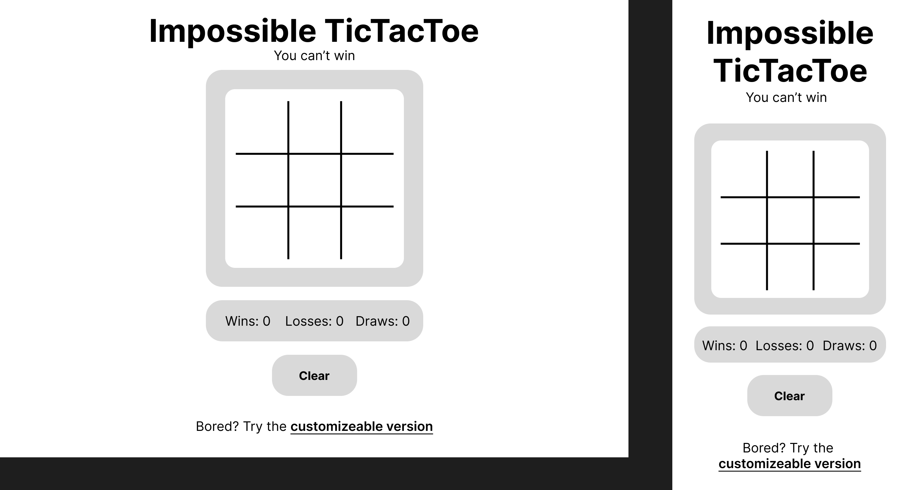
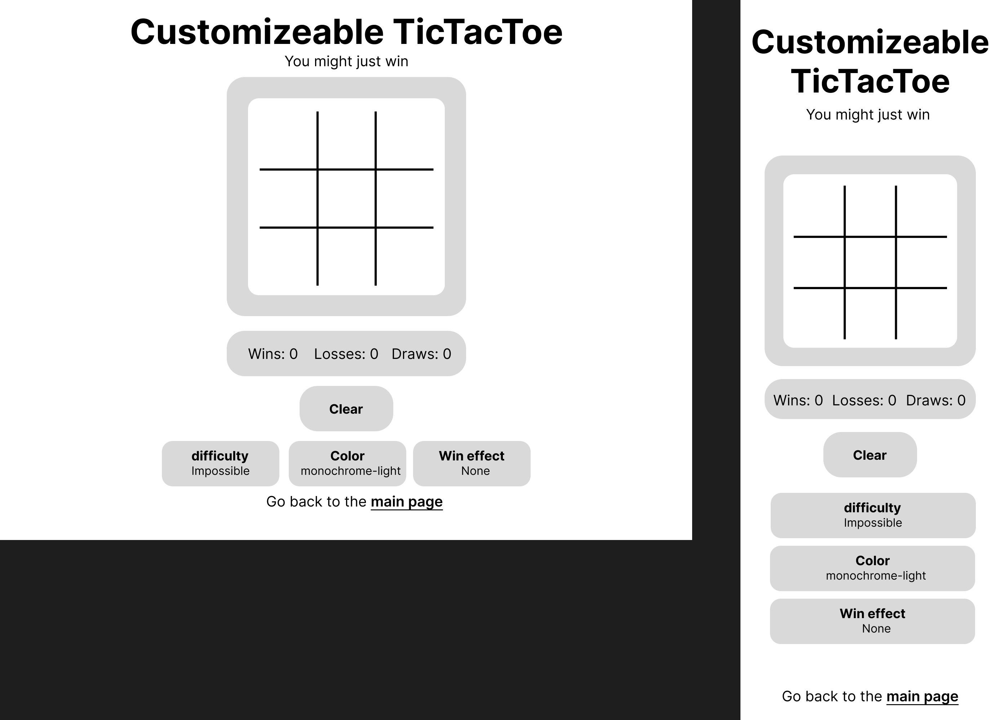

# Tic Tac Toe
**Impossible base game and an extra customizeable page**

## [Link to website](https://zoten64.github.io/TicTacToe/)

## Table of Contents:

* [Goals and target audience](#goals-and-target-audience)
* [Design](#design)
* [User stories](#user-stories)
* [Features](#features)
    * [Sitewide](#sitewide)
    * [Home page](#home-page)
    * [Care Guide Page](#care-guide-page)
    * [Our Leos Page](#our-leos-page)
    * [Rescue page](#rescue-page)
    * [About us page](#about-us-page)
    * [Other](#other)
* [Bugs and fixes](#bugs-and-fixes)
* [Technologies and tools](#technologies-and-tools)
* [Wireframes](#wireframes)
* [Validation and testing](#validation-and-testing)
* [Deployment](#deployment)
* [Credits](#credits)

## Goals and target audience

## Design

## User stories

1. As a player I want to play a tic tac toe game against an ai so that I can challenge myself
2. As a player I want the game to have a nice layout that is easy to understand
3. As a mobile user I want the website to be optimized for mobile to make it easier to navigate
4. As a desktop user I want the website to be optimized for desktop to make it easier to navigate
5. As a visually impaired user I want the website to be accessible so that I can also play
6. As a player I want difficulty settings
7. As a player I want customizeability
8. As a player I want to have fun playing 

## Features

## Bugs and fixes

| Bug  | Fix |
| ------------- | ------------- |
| AI is able to win when a valid combo has not been achieved  | Forgot to change xCombination to oCombination in the check win section as it was copied and pasted |
| Player can still make a move after the ai has won | Add checkWin() after the AI Move which locks the board |

## Technologies and tools
**Languages**
- HTML
- CSS
- Javascript

**Tools**
- Git/github
- Visual Studio Code
- Figma
- Firefox dev tools
- Chrome dev tools (Briefly)

## Wireframes

Impossible TicTacToe

Customizeable TicTacToe

## Validation and testing
**HTML**

**CSS**

**Javascript**

**Wave accessibility**

**Lighthouse performance**

**Other tests**

**Browsers tested**

**Testing Devices**

**Testing user stories**

## Deployment

**Deploying and accessing the website on github pages**

Deployed on github pages. [Link to website](https://zoten64.github.io/TicTacToe/)
The steps taken to deploy is:
- Go to the repository
- Find the settings tab
- Go to pages
- Click source and choose "Deploy from branch"
- Choose Main as the branch and click save
- Wait a few minutes while github compiles the page
- Click the link at the top of the page to go to your website

**How to fork the project**

- Navigate to the github repository (You're probably here already)
- In the right corner click fork and choose a name

**How to clone the project**

Prerequisities:

- Have git downloaded and configured

steps:

- Go to the repository (You're probably here already)
- Click the code button
- Copy the url
- Open git and change the directory to the parent directory that you want the project to clone to
- Write "git clone [the link you just copied]", in this case "git clone https://github.com/Zoten64/TicTacToe.git"

## Credits
